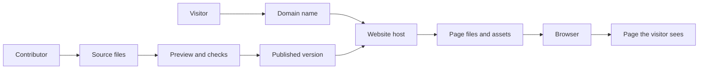

# Oikotaan Teen Contributor Manual

Welcome! This guide explains how to work on the Oikotaan website from your own
computer. You do not need to be an expert. You need a text editor, a few tools,
and a habit of previewing your work before asking for it to be published.

## The big picture

The website is made from files in this repository:

- **Astro** turns the files into web pages.
- **Markdown** and **YAML** files contain event, homepage, About, and
  Community Impact content.
- **CSS** controls colours, fonts, spacing, and layout.
- **Git** records changes on your computer.
- **GitHub** stores the project and lets people review changes.
- **Netlify** builds pull requests and gives each one a private preview URL.
- **Cloudinary** stores every photo and video, outside the repository.
- **The content editor** (`/admin`) is a no-code way to change content — see
  "The content editor" section below.

The live website comes from `main`. You should never edit `main` directly. Make
a branch, make one focused change, open a pull request, and wait for review.
Editing through `/admin` instead of code follows this same rule automatically —
see below.

## How websites work

A website is a collection of files and services that work together:

- A **domain name** is the human-friendly address, such as
  `www.oikotaannj.org`.
- A **browser** requests a page when someone types an address or clicks a link.
- A **host** stores the website and sends its files back to the browser.
- A **page** is the content shown at one address, such as a home page or event
  page.
- **Assets** are supporting files such as images, fonts, styles, and scripts.
- A **link** connects one page or website to another.
- A **form** collects information from a visitor and sends it to a service or
  inbox.

The browser turns the files it receives into the page people see. It combines
the page's content with its layout, colours, images, and interactive behaviour.
Different screen sizes may display the same page differently so that it remains
usable on a phone, tablet, or computer.

When a website is updated, someone changes the source files, checks the result,
and publishes a new version. A useful general workflow is:

```text
write -> preview -> check -> publish -> monitor -> improve
```

The source files are not usually edited directly on the live website. Keeping a
history of changes makes it possible to review work, find mistakes, and restore
an earlier version. Private information and passwords should never be placed in
public website files.



## How this website works

When someone visits Oikotaan, this is the basic journey:

1. They open a URL such as `/events/poila-boishakh-2026/`.
2. Netlify serves the finished files for that page.
3. Astro created those files earlier from the source code in this repository.
4. The source code combines page layouts, reusable components, styles, and
   content such as event Markdown files.

This site is **static**. There is no server or database running behind each
page. Astro builds the pages ahead of time, which makes the site fast and
reliable. GitHub stores the source files, Netlify builds them, and Netlify
publishes the result.

The normal publishing path is:

```text
your branch -> pull request -> Netlify preview -> review -> main -> live site
```

An event Markdown file is content. An Astro file is a template or page. A CSS
file controls appearance. Git records the change, and the pull request gives
another person a chance to check it before it becomes public.

## Code structure

Open the `oikotaan` folder in VS Code. These are the places you will use most:

```text
oikotaan/
├── src/
│   ├── content/events/       Event Markdown files; one file creates one event
│   ├── content/impact/       Community Impact entries; one file creates one entry
│   ├── content/home.yaml     Homepage text, hero image, programs, gallery
│   ├── content/about.yaml    About page's mission statement
│   ├── components/           Reusable pieces such as the header and event card
│   ├── layouts/              The shared shell around every page
│   ├── pages/                Website routes; index.astro is the homepage,
│   │                         about.astro is /about/, impact/index.astro is /impact/
│   ├── styles/global.css     Colours, fonts, spacing, and global styles
│   ├── site.config.ts        Organisation details, legal/tax facts, external links
│   ├── content.config.ts     Rules every content file is checked against
│   └── lib/dates.ts           Shared date formatting helpers
├── public/
│   ├── images/uploads/        Holds one placeholder SVG only; real photos live in Cloudinary
│   └── admin/config.yml       Settings for the content editor, incl. Cloudinary
├── .devcontainer/             Optional Codespaces setup
├── run.sh                     Start, check, build, and preview commands
├── package.json               Project commands and package list
├── netlify.toml               Netlify build and redirect settings
└── .nvmrc                     Required Node.js version
```

For a first contribution, stay inside `src/content/events/` or make a small
text change in a page. The most useful rule is: **content goes in content
files; repeated design goes in components; page-specific structure goes in
pages; appearance goes in CSS**.

Astro uses the filename inside `src/pages/` to decide a URL. For example,
`src/pages/events/index.astro` creates `/events/`, while
`src/pages/events/[...slug].astro` creates the individual event pages from the
event collection. Do not change the square-bracket route or the content schema
without asking a maintainer.

## What you can work on

Good beginner tasks include:

- fixing a typo or changing wording;
- adding or updating an event;
- adding an event image;
- adding a Community Impact entry (a food drive, volunteering, mutual aid);
- changing a homepage sentence or the About page's mission text;
- making a small spacing or layout improvement.

Ask an adult or technical maintainer before changing:

- `package.json`, Node versions, or installed packages;
- `astro.config.mjs`, `netlify.toml`, or deployment settings;
- GitHub permissions, Netlify, the domain, Cloudinary, or CMS authentication;
- the legal/tax facts near the top of `src/site.config.ts` (legal name, EIN,
  incorporation date, tax-exempt status) — these have to match the
  organisation's actual state and IRS filings exactly;
- routing, the content schema, or anything involving privacy or security.

## Set up your computer

The normal setup is **VS Code + Node.js 22 + Git**, plus a GitHub account with
access to the repository. These are free. Ask an adult before installing
software on a school-managed computer.

### 1. Create a GitHub account

1. Go to [github.com/join](https://github.com/join) and sign up with an email
   address you actually check — ask a parent first if you are not sure which
   one to use.
2. Pick a username you are comfortable being public. It will show up on every
   commit and pull request you make, forever, including after you graduate
   from this project.
3. Verify your email address — GitHub emails you a code or link, and some
   GitHub features (including accepting a repository invitation) do not work
   until you do.
4. Turn on two-factor authentication: **Settings → Password and
   authentication → Two-factor authentication**. This protects your account,
   and by extension the project, if your password ever leaks somewhere else.

Once your account exists, tell a maintainer your exact GitHub username so they
can give you access.

### 2. Get access to the repository

The code lives at
[github.com/oikotaannj/oikotaan](https://github.com/oikotaannj/oikotaan). The
repository is public, so anyone can look at it — but only people a maintainer
has explicitly added can push a branch to it, which is what this manual's
workflow assumes.

1. A maintainer goes to the repository → **Settings → Collaborators and
   teams → Add people**, and adds your GitHub username.
2. GitHub sends you an invitation — check
   [github.com/notifications](https://github.com/notifications) or your email,
   and accept it.
3. Once accepted, visit the repository page again. You should see the normal
   green **Code** button and be able to create branches. If you still see
   "Fork this repository" as your only option, the invitation has not been
   accepted yet.

### 3. Install the tools

Install these tools from their official websites:

1. **[VS Code](https://code.visualstudio.com/download)**: the editor where you
   will open and change files.
2. **[Git](https://git-scm.com/downloads)**: the tool that records and shares
   your changes. The official installer for both Windows and macOS already
   includes Git Credential Manager, which is what makes step 4 below work
   without extra setup.
3. **[Node.js 22 LTS](https://nodejs.org/en/download)**: the program that runs
   Astro. Do not install the newest
   version if it is not version 22; this project is pinned to Node 22 in
   `.nvmrc`.

On macOS, install Node 22 with `nvm` if it is already available:

```bash
nvm install 22
nvm use 22
```

On Windows, an adult can help install Node 22 with the official installer or
`nvm-windows`. On macOS, Git is included with the Xcode Command Line Tools; if
the terminal asks to install them, accept the prompt — but prefer the
installer linked above, since the Xcode Command Line Tools version does not
include Git Credential Manager. On Windows, Git Credential Manager is included
automatically with Git for Windows.

Open a new terminal after installing and verify all three tools:

```bash
code --version
node --version
git --version
```

The Node version should start with `v22`. If it does not, stop and fix the Node
version before continuing. If `code` is not recognised, open VS Code from the
Applications or Start menu; Git and Node can still work normally.

### 4. Connect Git to your GitHub account

Git needs to know who you are, separately from logging in to GitHub itself.
Set this once, using the same email address as your GitHub account:

```bash
git config --global user.name "Your Name"
git config --global user.email "the-email-on-your-github-account@example.com"
```

You do not need to do anything else in advance. The first time you `git push`
from this computer, a browser window opens automatically and asks you to log
in to GitHub and click **Authorize**. After that, Git remembers this computer
and will not ask again.

If a browser window does not open, or `git push` fails with something like
`could not read Username`, Git Credential Manager did not install correctly —
reinstall Git from the official link in step 3 and try again. GitHub
Codespaces does not need any of this: it is already signed in as you.

### 5. Download the project

By this point you should have a GitHub account, access to the repository, and
the tools installed. In a terminal, run:

```bash
git clone https://github.com/oikotaannj/oikotaan.git
cd oikotaan
npm install
code .
```

The first `npm install` can take a few minutes. It downloads the project's
packages into a local folder called `node_modules`; you do not edit that folder
or commit it to Git.

If `code .` does not work, open VS Code normally and choose **File > Open
Folder**, then select the `oikotaan` folder.

You only need to clone the project once. The next time, open the existing folder
and start at [Get ready for a new change](#get-ready-for-a-new-change).

## Start the website

From the project folder, run:

```bash
./run.sh start
```

Open <http://localhost:4321> if the browser does not open automatically. Keep
the terminal running while you work. When you save a file, the browser updates.

Useful commands:

| Command            | What it does                                            |
| ------------------ | ------------------------------------------------------- |
| `./run.sh start`   | Starts the editable development site on port 4321       |
| `./run.sh stop`    | Stops the development site                              |
| `./run.sh restart` | Stops and starts it again                               |
| `./run.sh status`  | Checks whether the site and important routes respond    |
| `./run.sh logs`    | Shows the development server log                        |
| `./run.sh admin`   | Opens the local content editor at `/admin`              |
| `./run.sh preview` | Builds and serves the production-like site on port 4322 |
| `./run.sh check`   | Runs formatting, type checks, and the build before a PR |

When you are done, stop the site with:

```bash
./run.sh stop
```

## Where to edit

| Task                                           | File or folder                                  |
| ---------------------------------------------- | ----------------------------------------------- |
| Add or edit an event                           | `src/content/events/`                           |
| Add or edit a Community Impact entry           | `src/content/impact/`                           |
| Change homepage text, hero image, or gallery   | `src/content/home.yaml`                         |
| Change the About page's mission text           | `src/content/about.yaml`                        |
| Change homepage structure (not just text)      | `src/pages/index.astro`                         |
| Change the header or footer everywhere         | `src/components/Header.astro` or `Footer.astro` |
| Change colours and fonts                       | `src/styles/global.css`                         |
| Change organisation details and external links | `src/site.config.ts`                            |
| Change the page shell and `<head>`             | `src/layouts/BaseLayout.astro`                  |

Everything in the first four rows can also be edited without touching code at
all, through the content editor — see "The content editor" below.

For a normal event update, the safest choice is an existing Markdown file in
`src/content/events/`. The filename becomes part of the event URL.

### Editing an event

An event file starts with frontmatter between the two `---` lines. Copy an
existing event and change its values carefully:

```md
---
title: "Community Picnic"
date: 2026-06-14
time: "12:00 PM onwards"
venue: "Community Park"
address: "1 Main Street, Edison, NJ"
summary: "A relaxed afternoon for the whole community."
image: "https://res.cloudinary.com/yxpsjuuc/image/upload/v.../picnic.jpg"
imageAlt: "Families sharing food at picnic tables"
featured: false
draft: false
---

Write the event details here.
```

You do not type the `image` URL by hand — editing through code, use the
`/admin` editor for just that field, or paste in the link Cloudinary gives you
after you upload there directly.

Keep `draft: true` while an event is unfinished. It will not appear as a normal
published event. Change it to `false` only when the information is ready and an
adult has approved it.

Do not add image files to the repository. Use the `image` field's picker in
the `/admin` editor — it opens Cloudinary, where you upload the photo and it
hands back a hosted link, resized and optimised automatically. Every image
needs useful `imageAlt` text; use `alt: ""` only for decoration that
communicates no information.

## The content editor (`/admin`)

Everything above this point describes editing content by hand, in code,
through a branch and a pull request. There is a second way to make the same
kind of change — events, the homepage, the About page, Community Impact
entries — without opening a code editor or knowing Git at all: the content
editor, called **Sveltia CMS**, at `/admin` on the live site (or
`./run.sh admin` locally).

1. Open `/admin` and sign in with your GitHub account. You need the same
   repository access described in "Get access to the repository" above —
   the CMS is just a friendlier window onto the same GitHub repository, not a
   separate system with its own permissions.
2. Pick a collection on the left — **Events**, **Community Impact**, or one of
   the singleton **Pages** entries (Home Page, About Page) — and either open an
   existing entry or create a new one.
3. Fill in the form. Each field matches a piece of frontmatter described
   elsewhere in this manual (title, date, image, and so on); the CMS just
   draws them as a form instead of raw text.
4. Save. Unlike the branch-and-pull-request workflow described elsewhere in
   this manual, the CMS is configured to commit straight to `main` — your
   change goes live as soon as Netlify rebuilds, usually within a minute or
   two, with no separate review step. That trade was made deliberately (see
   `public/admin/config.yml`) so non-technical committee members can publish
   routine updates themselves; it means there is no safety net catching a
   typo before it's public, so read the form over once before saving.

This is only safe because of what `/admin` cannot do: it only ever edits
fields inside the four collections defined in `public/admin/config.yml`, each
bounded by the schema in `content.config.ts`. There is no field anywhere in
it that creates a page, a route, a nav item, or a new collection — anything
structural like that requires editing an `.astro`/`.ts` file directly, which
stays on the branch → pull request → review → merge path no matter what the
CMS's `publish_mode` is set to. Keep it that way: adding a new collection to
`config.yml` inherits direct-publish too, so think about whether that's still
"editorial" before adding one.

**As of this writing, sign-in at `/admin` may not work yet** — it depends on a
one-time setup step (a small Cloudflare Worker) that a maintainer sets up
separately from anything in this manual. If sign-in fails, that is very
likely why; ask a maintainer whether it has been deployed rather than
assuming your account or computer is the problem.

## Cloudinary (photos and video)

Photos and video are not stored in this Git repository — they live in
**Cloudinary**, a separate hosting service, and every image/file field in the
CMS (the `image` field on an event, for example) opens Cloudinary's own
picker instead of your computer's file browser. This keeps the repository
small no matter how many photos get added over the years: Git keeps every
version of every file forever, and a few years of full-size event photos
would make cloning the project slow for everyone on the team.

To add a photo: open the relevant field in `/admin` and use Cloudinary's
upload button. You should not need to sign into Cloudinary separately — the
picker already knows which account to use. If it ever does prompt you to sign
in, stop and ask a maintainer rather than creating your own Cloudinary
account; photos need to land in the organisation's shared account, not a
personal one.

If you are editing an event's Markdown file directly instead of through
`/admin`, the `image` field is a full Cloudinary URL
(`https://res.cloudinary.com/...`) — copy it from Cloudinary or from the CMS
rather than typing one by hand.

## Get ready for a new change

Before starting, make sure your copy is up to date:

```bash
git checkout main
git pull origin main
git checkout -b update-event-details
```

Use a branch name that describes the task, such as:

- `add-poila-boishakh-event`
- `fix-homepage-typo`
- `improve-mobile-event-cards`

Do not use names like `stuff` or `fix`. One branch should contain one focused
change. If you have two unrelated ideas, make two branches and two pull
requests.

## Make and inspect your change

1. Open the relevant file in VS Code.
2. Change the smallest amount of code or content needed.
3. Save the file and look at the local website.
4. Check the page at a narrow browser width as well as a desktop width.
5. Check links, spelling, dates, images, and headings.
6. Review what Git sees:

```bash
git status
git diff
```

The diff should contain only the change you intended. If it includes something
you do not recognise, stop and ask for help.

## Test before sharing

First use the fast local browser preview. Then run the same kind of checks that
CI and Netlify will run:

```bash
./run.sh check
```

This checks formatting, validates the content and TypeScript, and builds the
site. A successful check ends with `check passed.`

For an extra check of the built version:

```bash
./run.sh preview
```

Open <http://localhost:4322>. Press `Ctrl-C` in that terminal to stop this
preview server.

If a check fails, read the last part of the error. It often names the file and
the exact problem. Fix the cause and run the same command again. Do not hide a
failure or remove a validation rule just to make the command green.

## Commit and push

When the change looks correct and checks pass:

```bash
git add src/content/events/your-event.md
git status
git commit -m "Add community picnic event"
git push -u origin update-event-details
```

Replace the path, commit message, and branch name with your actual change. For
several deliberately changed files, you can use `git add .`, but inspect
`git status` first. A commit message should say what changed. Avoid messages
like `update`, `changes`, or `fixes`.

## Open and finish the pull request

1. Open the repository on GitHub. Click **Compare & pull request**.
2. Explain what you changed and why.
3. Mention how you tested it, for example: `./run.sh check` and a phone-sized
   browser check.
4. Ask the appropriate adult or maintainer for review.
5. Wait for the Netlify **deploy preview** check. Open its URL and test the
   actual preview on your computer and phone if possible.
6. Respond to review comments by editing the same branch, then run checks,
   commit, and push again. The pull request updates automatically.
7. A maintainer merges the pull request after review. Do not merge your own
   change unless the team has explicitly given you that responsibility.

After merging, clean up your local copy:

```bash
git checkout main
git pull origin main
git branch -d update-event-details
```

## Common problems

**`npm` or `node` is not recognised.** Node.js is not installed or is not on
your PATH. Install/select Node 22, then open a new terminal.

**The browser says the site cannot be reached.** Run `./run.sh status`. If the
server is stopped, run `./run.sh start`. If another process is using a port,
ask an adult before stopping it.

**The build says the event collection is invalid.** Check the frontmatter in the
event file against another event. A date, quote, indentation, or field name is
probably wrong.

**Git says there is a merge conflict.** Do not panic or delete random files.
Open the marked file, choose the text that should remain, remove the conflict
markers, save, then run `git add`, `git commit`, and `git push`.

**GitHub rejects your push with "permission denied" or "403".** Most often
this means you have not accepted the repository invitation yet — check
[github.com/notifications](https://github.com/notifications) — or the Git
login from step 4 of setup authorized a different GitHub account than the one
a maintainer added. Copy the full error and ask the maintainer; do not paste
passwords or tokens into chat.

**You changed or deleted the wrong thing.** Stop editing and ask for help. Git
usually has the old version, so more random changes will only make recovery
harder.

**`/admin` will not let you sign in.** The CMS's GitHub sign-in depends on a
separate one-time setup step a maintainer does; it may simply not be deployed
yet. Ask a maintainer rather than assuming it is your account. In the
meantime, edit the same content by hand in code — see "Where to edit."

## Safety and privacy rules

- Never commit passwords, tokens, private keys, or personal data.
- Do not publish photographs of children without a parent's consent.
- Never push directly to `main`.
- Never commit an image file to the repository — use the CMS's Cloudinary
  picker instead.
- Do not add packages or change hosting settings without adult approval.
- Check the Netlify preview before anything is merged.
- Share the actual error message when asking for help, along with what you
  already tried.

That is the complete loop: **branch, change, preview, check, commit, push,
review, merge**.
